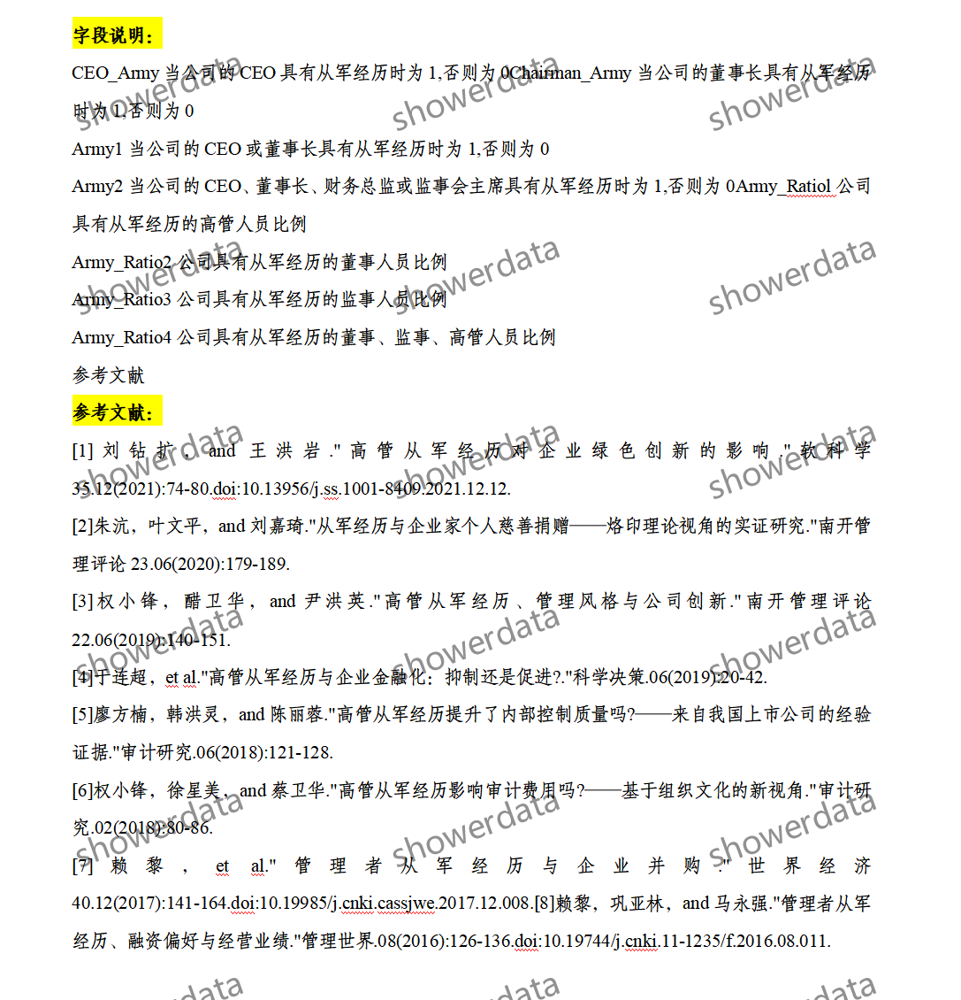
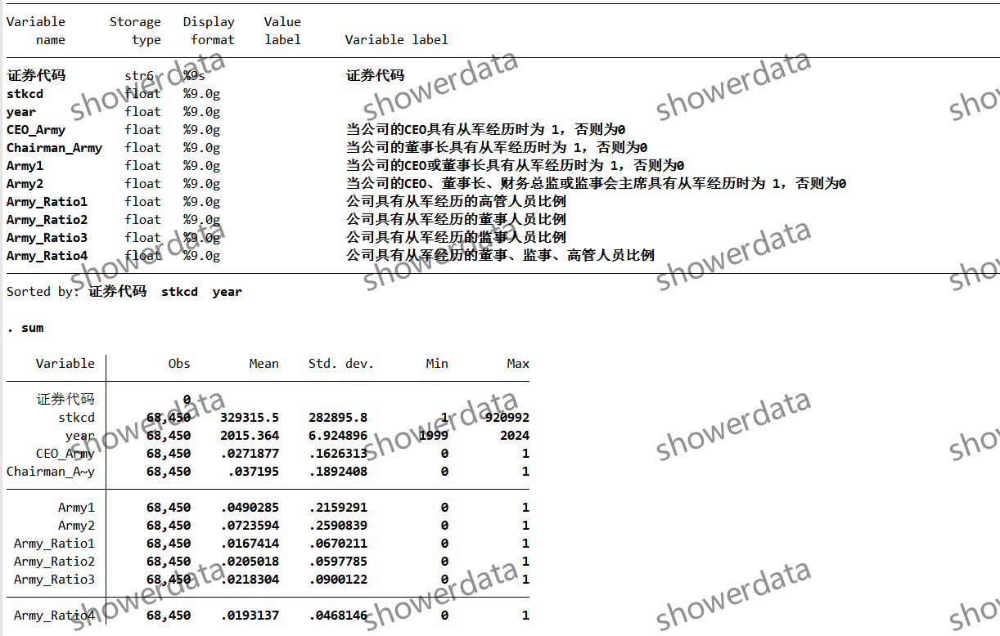
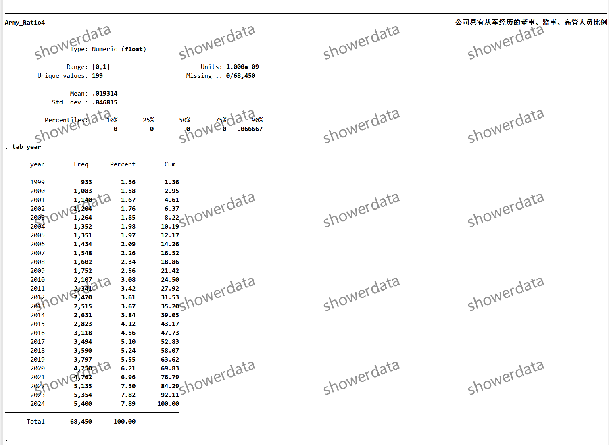
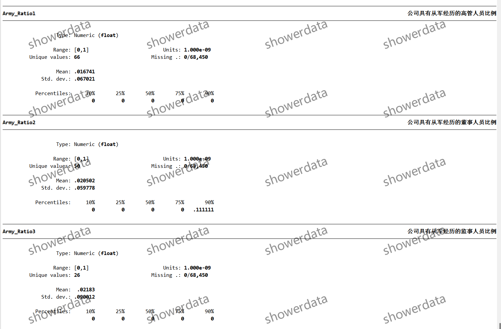
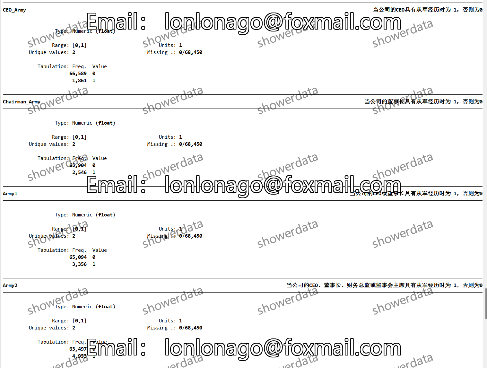
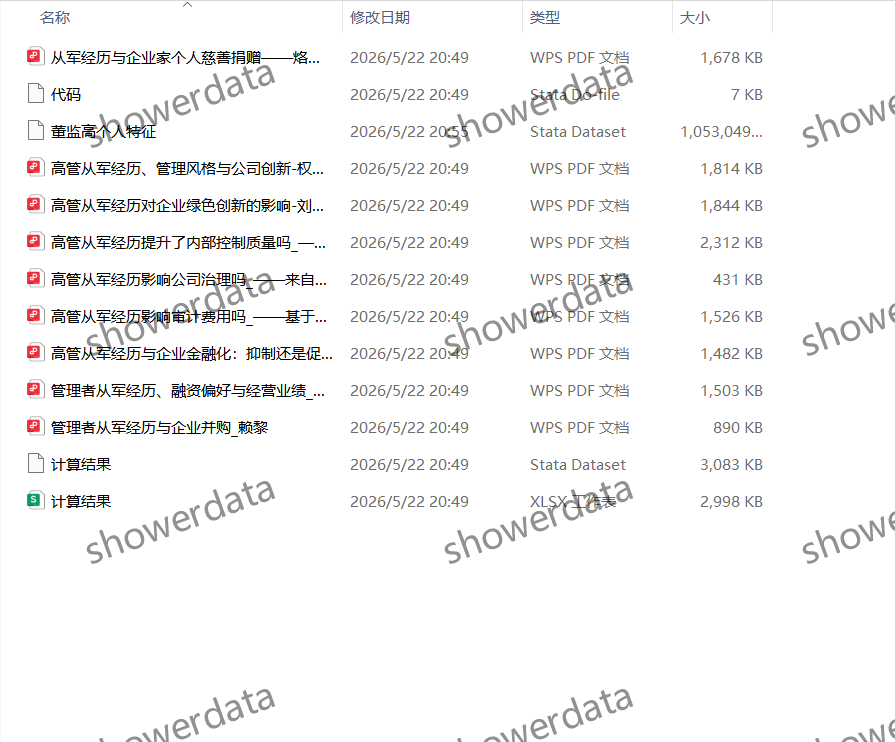

## Body

（1999-2024年）上市公司-企业高管从军经历

After purchase, refunds are not supported without reason. There may be missing values, please read carefully before purchasing or ask clearly before buying! The display description is unadjusted for outliers.

I. Data Introduction
(1) Details of the data: See the image below, please read carefully before purchasing! The displayed information has been explained, please confirm whether it is what you need before purchasing! No returns or exchanges will be accepted for any reason after shipment! Please confirm that you will use it before purchasing, no questions provided on答疑, thank you! There may be missing values due to objective reasons, if you do not mind, please do not purchase, thank you!
(2) Name of the data: List of Corporate Executives' Military Experience in Listed Companies
(3) Sample range: A group of companies
(4) Time range: From 1999 to 2024
(5) Data format: Excel, DTA
(6) Content of the data: Results, References, Codes, References

II. Data Result Indicators as shown in the figure

III. Method of indicator construction as shown in the figure

IV. References as shown in the figure

## Images

Here is a pay link on Stripe ( https://buy.stripe.com/3cs8yP7sY87d0vu9AB ). Please contact me lonlonago@foxmail.com after funding $89, and I will send you a complete data files , thank you!

